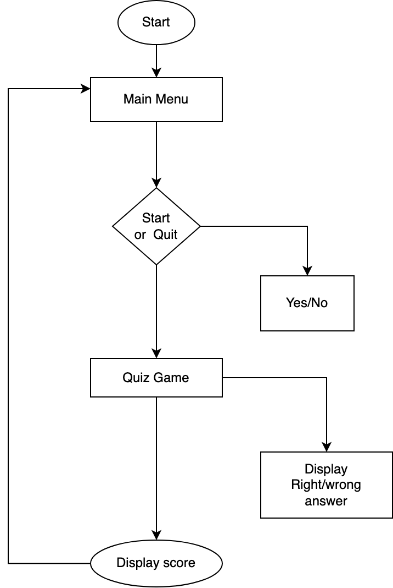
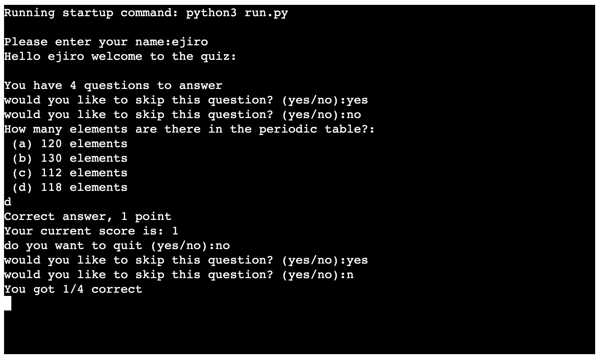

# GENERAL KNOWLEDGE QUIZ

 
## Introduction
This is a quiz game, is created for everyone to test general knowledge, it contains 4 questions. its flexible with by gvien users choices. 

## User Stories
- the user has the option to skip a question or quit the quiz. 
- the options to each question is display
- the user scores displays depending on the answer to the qeustion
- the user sees immediate progression in the game
 
## Features
- show qiuz scores
- show quiz score in guage
- view correct options
- view question results

## Flow-chart

## Technology
- Python
- Gitpod

## Testing

### Code Validation
- the user is prompt to enter yes/no
- the user input is validated enter the given options
- the user's name is also validated when they type in only alphbet 
- the user gets an error if they input numerical type

### Test cases

* the user login
* the user enters name
* the computer welcomes the user
* the user is given quit option
* the user is also given skip option

### Test cases
- Login area introduces the users name. in the screen view, you can see the users name.
- The computer welcomes the user as it logs you in.
- The computer displays the questions, check if the user's answer is wrong, display the current score and a quit option is given to the user.
- Screen 4 displays the user's correct answer and shows the score, the quit option and skip option.

## Plyint error
* code was checked in pep8onlie.com 

* Three errors was found
* PascalCase name style was fixed
* Missing function or method docstrong was not able to fix
* Trailing whitespace was not able to fix

## Requirements
* Python 3.7
* No external mudole or library is included in this project

## Deployment
* deployed the pages with Heroku platform
* Log into the Heroku account
* Click on the dashboard
* create a new app and name it
* Select region
* Click add buildpack and select python and node and save changes
* click on deploy tab, and choose deployment method
* Select Github and connect
* Select automatic deploy
* Click on deploy branch
* - VIA GITPOD
- - Open the Python file 
- - Go to the debug menu and select “Add Configuration…”
- - in the dropdown choose “Python”
- - choose “Python File” as the debug configuration.
- - Finally, start debugging your Python program!

## Credit
Amulya's Academy, Lee Rock, Senior Data Analyst at Google, Mike Dane and Rishabh Singh.

