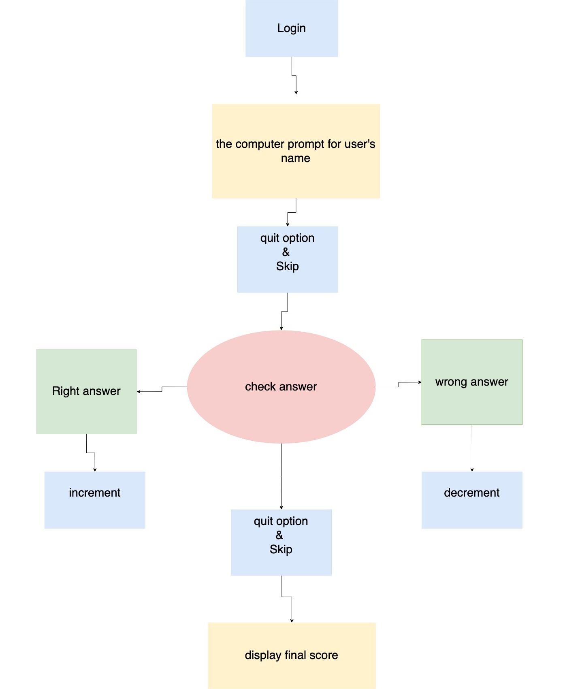
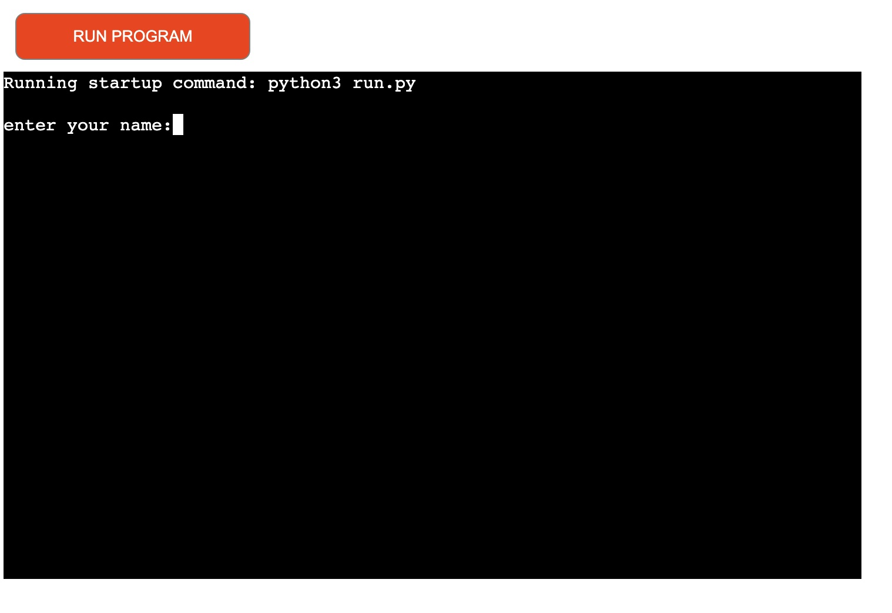
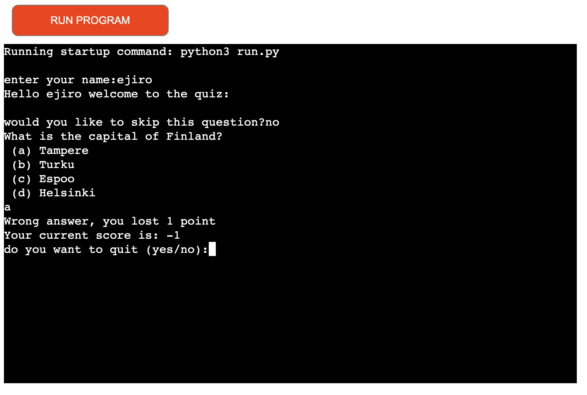
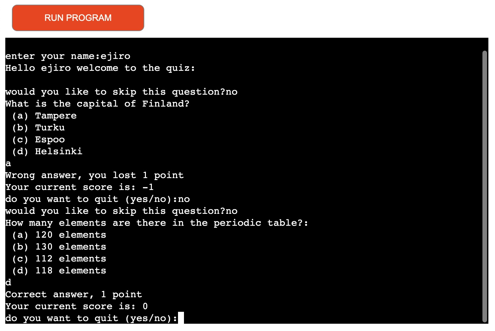
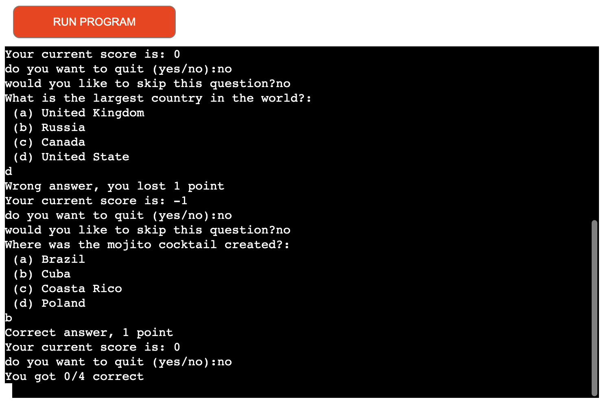
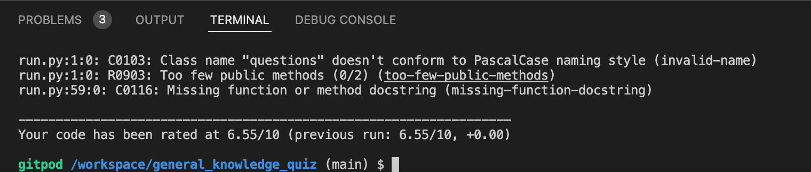

# GENERAL KNOWLEDGE QUIZ

 

## Introduction
This is a quiz created for everyone to test their general knowledge, it contains 4 questions and the user has the option to skip a question or quit the quiz. the image below shows the full view of the quiz on the screen.

## Flow-chart diagram of the quiz

## Testing
* Code Validation
* code was validated in pep8onlie.com 
* white and blank spaces was removed
## Test cases

* the user login
* the user enters name
* the computer welcomes the user
* the user is given quit option
* the user is also given skip option

Login area introduces the users name. in the screen view, you can see the users name.

The computer welcomes the user as it logs you in.

The computer displays the questions, check if the user's answer is wrong, display the current score and a quit option is given to the user.

Screen 4 displays the user's correct answer and shows the score, the quit option and skip option.

Screen 5 finally displays final and total score of the user.

## Requirements
* Python 3.7
* No external mudole or library is included in this project

## Deployment
* deployed the pages with Heroku platform
* Log into the Heroku account
* Click on the dashboard
* create a new app and name it
* Select region
* Click add buildpack and select python and node and save changes
* click on deploy tab, and choose deployment method
* Select Github and connect
* Select automatic deploy
* Click on deploy branch
* - VIA GITPOD
- - Open the Python file 
- - Go to the debug menu and select “Add Configuration…”
- - in the dropdown choose “Python”
- - choose “Python File” as the debug configuration.
- - Finally, start debugging your Python program!

## Plyint error

* Three errors was found
* PascalCase name style was fixed
* Missing function or method docstrong was not able to fix
* Trailing whitespace was not able to fix

## Credit
Amulya's Academy, Lee Rock, Senior Data Analyst at Google, Mike Dane and Rishabh Singh.

